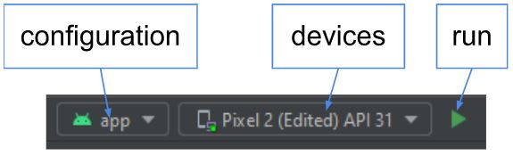

# Maréu

## Description
Ce dépôt contient une mini-application pour le P4 du parcours “Développement d’application Android” d’Openclassrooms.

Cette application consiste à:
* Afficher une liste de réunion.
* Faire une création d'une nouvelle réunion
* Supprimer une réunion
* Filtrer une réunion
  * par date/heure
  * par salles
* Trier une Réunion
  * par date/heure
  * par salles
## Prérequis
* Installation de [Android Studio](https://developer.android.com/studio?gclid=CjwKCAiAlp2fBhBPEiwA2Q10DylEC18SIGfmsSq9IHXwIvfDtvdeyjUUL9axVlY7wGES4gyH5kgjdxoCqlsQAvD_BwE&gclsrc=aw.ds)
* Installation du [Java sdk](https://www.oracle.com/fr/java/technologies/downloads/)
* Installation de [Git](https://git-scm.com/book/fr/v2/D%C3%A9marrage-rapide-Installation-de-Git)
* connécence de l'architecture [MVVM](https://youtu.be/ijXjCtCXcN4) 
## Comment exécuter et compiler
* Ouvrir les fichiers avec android studio
* Synchroniser le build.gradle
    * minSdkVersion 21
    * targetSdkVersion 33
    * dépendances
        * viewmodel
        * livedata
        * [espresso](https://developer.android.com/training/testing/espresso)
* Sélectionner le device pour l'émulateur
* Sélectionner “app” dans la configuration
* appuyer sur le bouton Run

